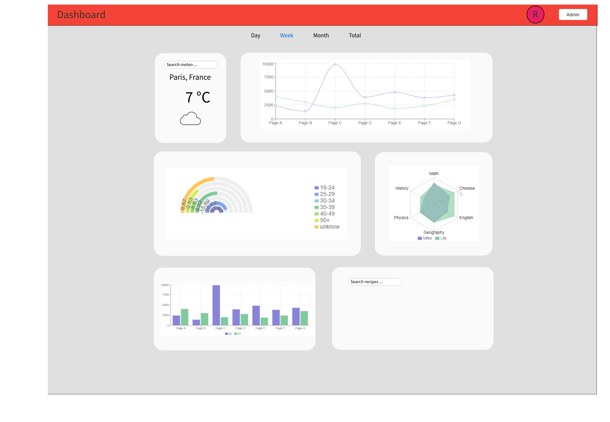
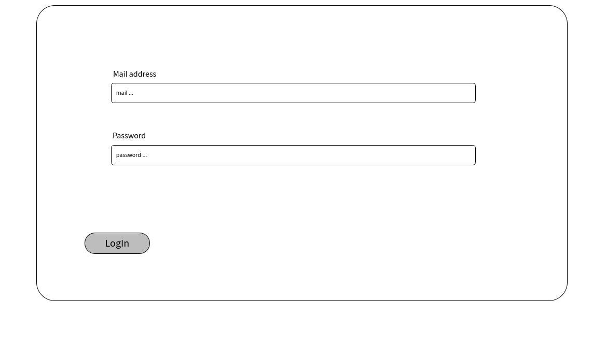
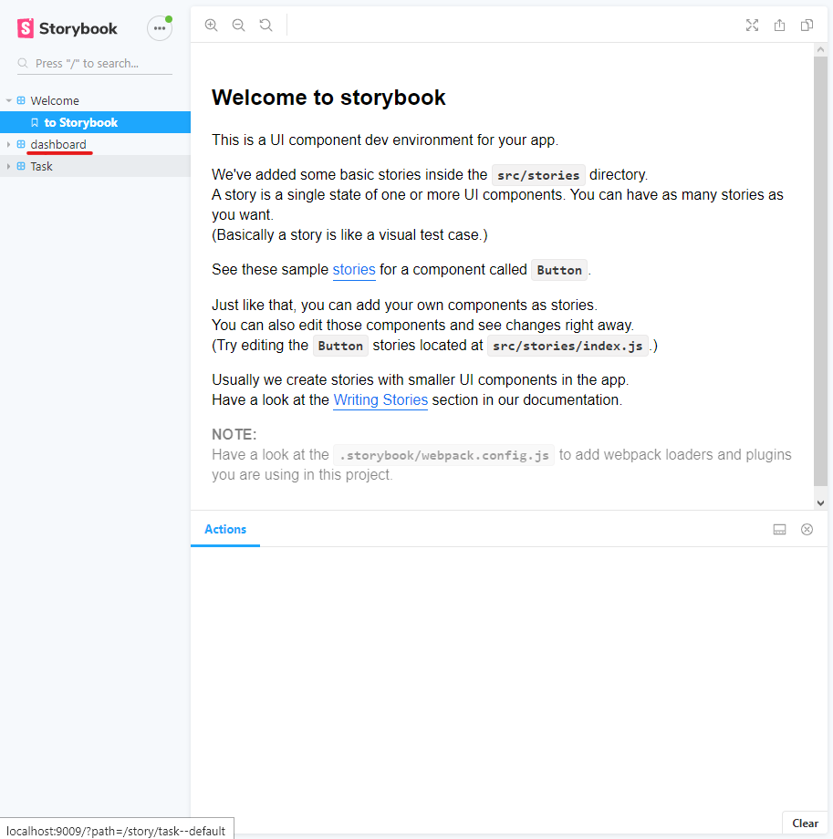
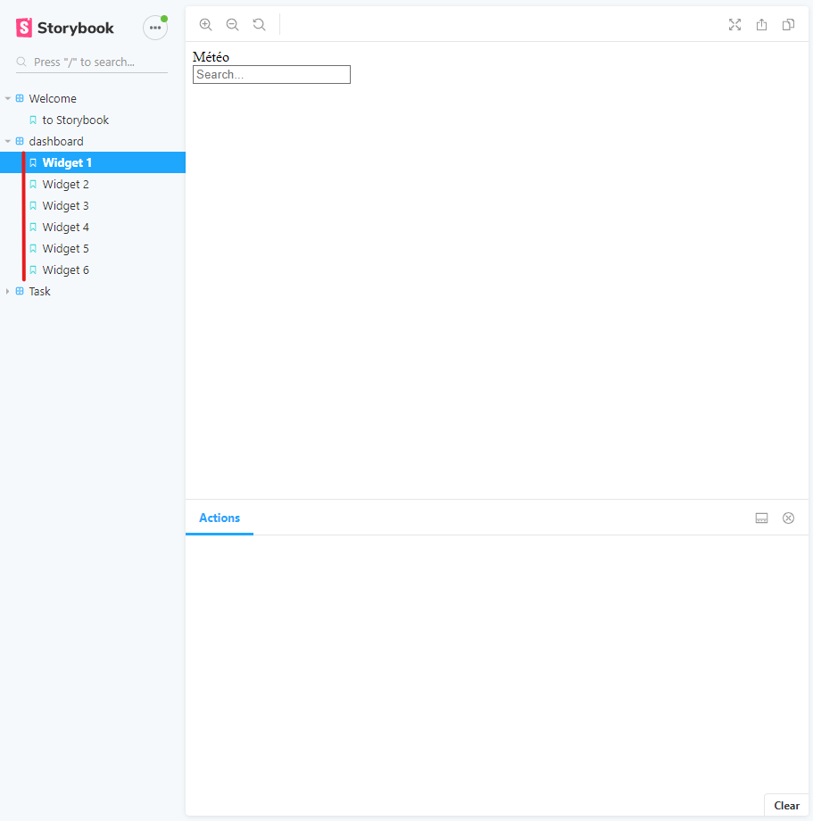

# Projet de fin de semestre
## EL Baamrani Romain - Duong Pierre

A lire impérativement avant de commencer quoi que ce soit, ce sont les règles que vous devrez appliquer tout au long du semestre:

<p align="center">
 <a href="https://gitlab.com/Adrien_Kourganoff/instructions_web_ocres_ing4/-/blob/master/README.md">Règles pour le semestre</a>
</p>

## Introduction
Notre projet porte sur la création d'un dashboard de suivit sportif avec react et une base de données mongodb. Il y a 6 widgets dont deux utilisant des Api extérieurs 
widget 1: météo du lieu entrée dans la barre de recherche.
widget 2: affichage des performances.
widget 3: affichage de la distance parcourue pendant le mois.
widget 4: affichage des calories dépecées 
widget 5: affichage du temps consacré à chaque activité.
widget 6: affichage d'une idée de recette en fonction des critères rentrées dans la barre de recherche.
## Documentation

### EL Baamrani Romain - Duong Pierre




### Pour accéder aux storybooks
```shell
$ cd .\frontend\
```

```shell
$ npm run storybook
```



### installation du package pour le frontend et backend
```shell
$ cd .\frontend\
```

```shell
$ npm install
```

```shell
$ cd .\backend\
```

```shell
$ npm install
```

### lancement de l'application

```shell
$ cd .\backend\
```

```shell
$ npm run dev
```

### Trello
lien: https://trello.com/b/P4PnWpMG/projet-web-frontend
