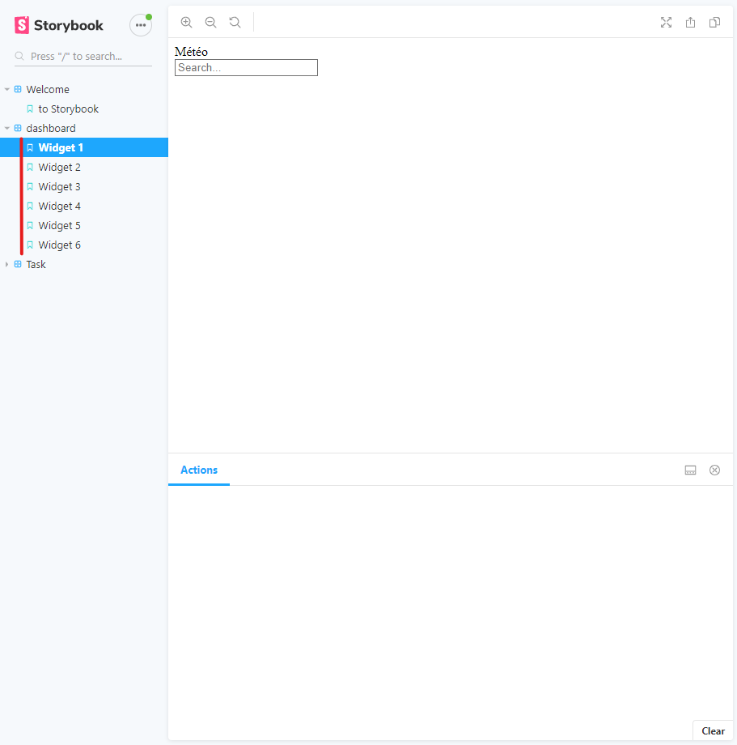

# Frontend

Ce dossier contiendra la partie frontend de votre projet.

Le frontend à été initalisé avec un create-react-app et sotrybook y est deja installé avec un exemple de stories que vous trouverez dans le repertoire `src/stories`.

Storybook est là pour vous aider à prototyper et documenter vos composants. Si nous n'arrivons pas à lancer votre projet, nous pourrons au moins regarder vos composants en fonctionnement.

## Documentation

### EL Baamrani Romain - Duong Pierre


### Pour accéder aux storybooks
```shell
$ npm run storybook
```



### installation du package et lancement

```shell
$ npm install
```

```shell
$ npm start
```

### Trello
lien: https://trello.com/b/P4PnWpMG/projet-web-frontend


